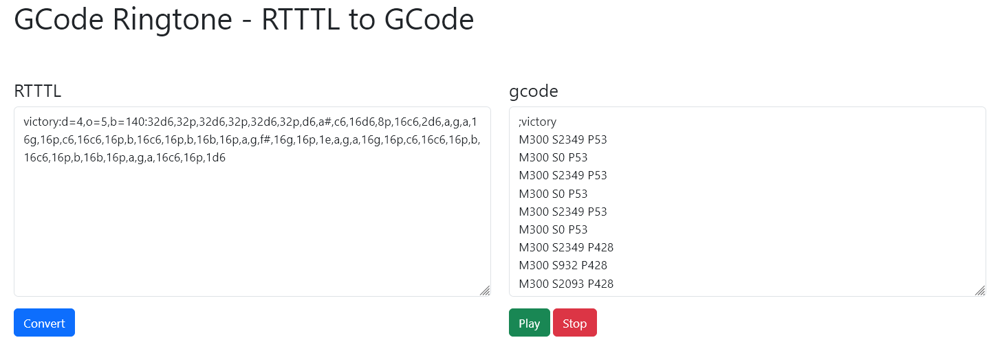

# GCode Ringtone

Convert Ring Tones Text Transfer Language (RTTTL) to GCode for playback on 3D printers. This is greate for using the numerious free ringtones online as finish or status sounds for your printer.

This requires your firmware to support M300 and your printer will need a buzzer.

It just uses javascript so you can use the converter in your browser here: [GCode-Ringtone](https://foorschtbar.github.io/GCode-Ringtone/)

## Credits

This is based on the work of [DDRBoxman/RepRapRingtone](https://github.com/ddrboxman/RepRapRingtone/).
